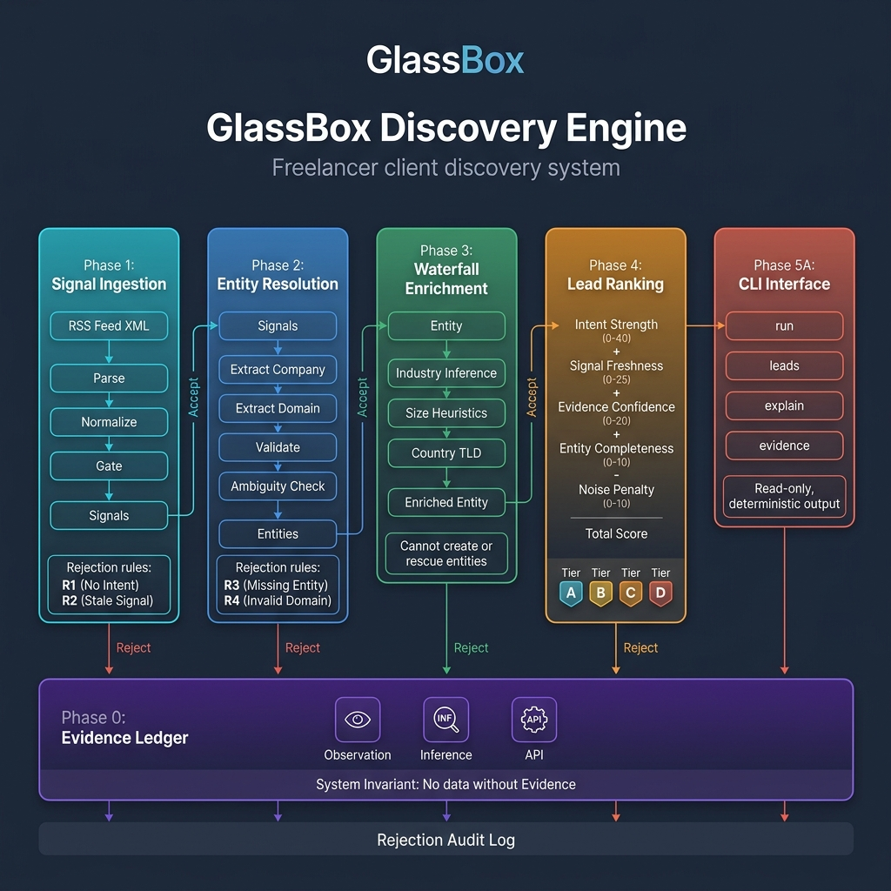
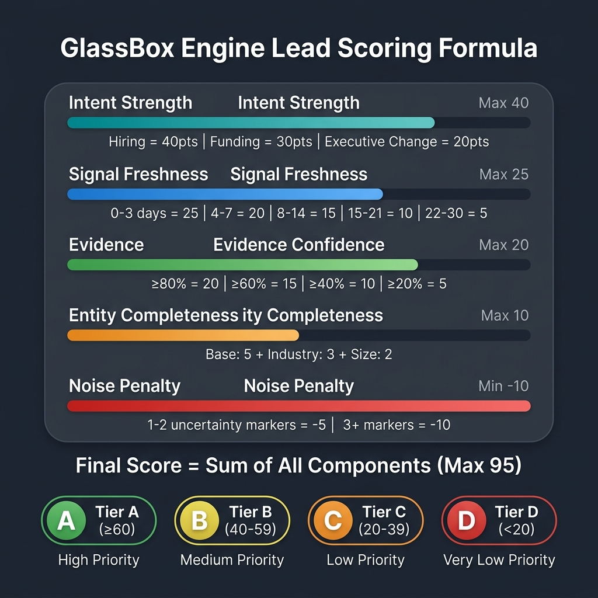
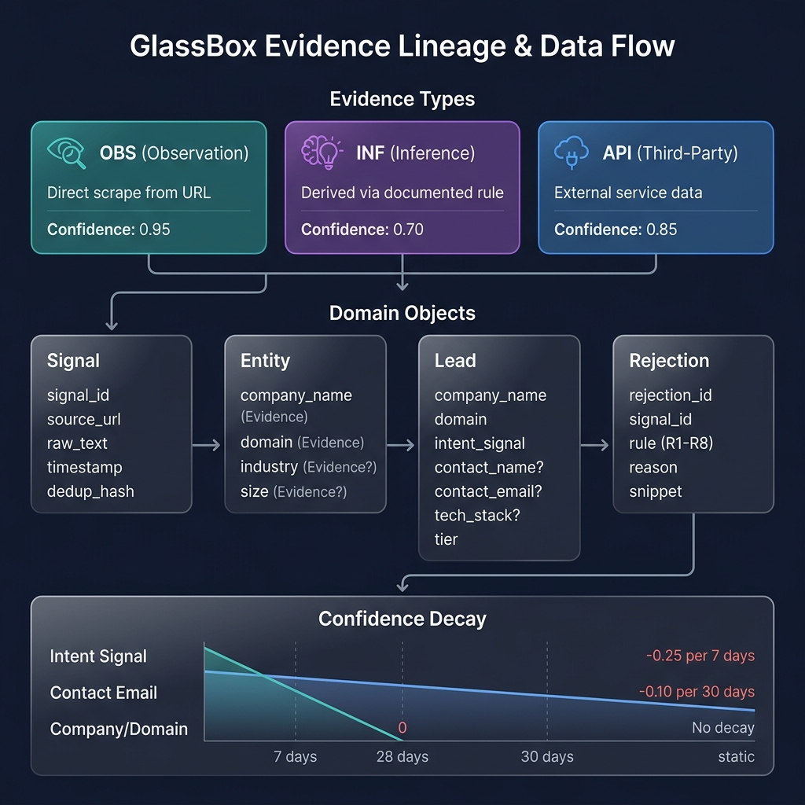

<h1 align="center">
  🔍 GlassBox Discovery Engine
</h1>

<h3 align="center">
  Complete Architecture & System Design Documentation
</h3>

<p align="center">
  <em>An explainable, logic-first client discovery engine for freelancers</em>
</p>

<p align="center">
  
  
  
  
  
</p>

---

## 📐 Architecture Overview

GlassBox is a **6-phase pipeline** that converts raw RSS job board signals into ranked, fully-explainable lead recommendations. Every piece of data carries cryptographic provenance through an Evidence Ledger — the system's foundational invariant.



### Core Design Principles

| Principle | Implementation |
|-----------|---------------|
| **Explainability** | Every output traces to its source via Evidence Objects |
| **Determinism** | Same input → same output. No random seeds, learned weights, or user preferences |
| **Precision over Recall** | Reject ambiguity rather than guess. False positives erode trust |
| **Transparency** | No hidden logic, no black boxes, no proprietary algorithms |
| **Auditability** | Every rejection is logged with rule, reason, and signal snippet |

---

## 🏗️ System Architecture Diagram

```
┌─────────────────────────────────────────────────────────────────────────────────┐
│                        GlassBox Discovery Engine v0.1.0                        │
│                     "The architecture is the product."                          │
├─────────────────────────────────────────────────────────────────────────────────┤
│                                                                                 │
│  ┌──────────┐    ┌──────────┐    ┌──────────┐    ┌──────────┐    ┌──────────┐  │
│  │ PHASE 1  │    │ PHASE 2  │    │ PHASE 3  │    │ PHASE 4  │    │ PHASE 5A │  │
│  │          │    │          │    │          │    │          │    │          │  │
│  │  Signal  │───▶│  Entity  │───▶│ Waterfall│───▶│   Lead   │───▶│   CLI    │  │
│  │Ingestion │    │Resolution│    │Enrichment│    │ Ranking  │    │Interface │  │
│  │          │    │          │    │          │    │          │    │          │  │
│  └────┬─────┘    └────┬─────┘    └──────────┘    └──────────┘    └──────────┘  │
│       │               │                                                         │
│       ▼               ▼                                                         │
│  ┌─────────────────────────┐                                                    │
│  │   REJECTION AUDIT LOG   │ ◄── Explicit rejects with R1–R8 rules             │
│  └─────────────────────────┘                                                    │
│                                                                                 │
│  ═══════════════════════════════════════════════════════════════════════════════  │
│  ║                    PHASE 0: EVIDENCE LEDGER (Foundation)                  ║  │
│  ║  System Invariant: No field, attribute, inference, or score may exist     ║  │
│  ║  without an attached Evidence Object. Violations cause hard failures.     ║  │
│  ║                                                                           ║  │
│  ║  Evidence Types:  OBS (0.95) │ INF (0.70) │ API (0.85)                   ║  │
│  ═══════════════════════════════════════════════════════════════════════════════  │
└─────────────────────────────────────────────────────────────────────────────────┘
```

---

## 📦 Project Structure

```
GlassBox-Engine/
├── glassbox/                        # Main application package
│   ├── __init__.py                  # Package root — states the core invariant
│   ├── evidence.py                  # 🔐 Phase 0 — Evidence Ledger system
│   ├── domain.py                    # 📋 Phase 0 — Domain objects (Signal, Entity, Lead, Rejection)
│   ├── validation.py                # ✅ Phase 0 — Gating & validation logic
│   │
│   ├── ingestion/                   # 📡 Phase 1 — Signal Ingestion
│   │   ├── __init__.py
│   │   └── rss.py                   # RSS feed parser, normalizer, and gating
│   │
│   ├── resolution/                  # 🏢 Phase 2 — Entity Resolution
│   │   ├── __init__.py
│   │   └── entity_resolver.py       # Company name/domain extraction & validation
│   │
│   ├── enrichment/                  # 🔍 Phase 3 — Waterfall Enrichment
│   │   ├── __init__.py
│   │   └── waterfall.py             # Industry, size, country inference
│   │
│   ├── ranking/                     # 📊 Phase 4 — Lead Ranking
│   │   ├── __init__.py
│   │   ├── components.py            # Individual scoring components
│   │   └── scorer.py                # Lead scorer, tier assignment, explanation
│   │
│   └── cli/                         # 💻 Phase 5A — CLI Interface
│       ├── __init__.py
│       ├── __main__.py              # Module execution entry point
│       ├── main.py                  # CLI argument parser & commands
│       └── pipeline.py              # Pipeline orchestrator
│
├── tests/                           # Test suite (6 test files, one per phase)
│   ├── test_phase0.py               # Evidence Ledger tests
│   ├── test_phase1_ingestion.py     # Signal ingestion tests
│   ├── test_phase2_resolution.py    # Entity resolution tests
│   ├── test_phase3_enrichment.py    # Waterfall enrichment tests
│   ├── test_phase4_ranking.py       # Lead ranking tests
│   └── test_phase5a_cli.py          # CLI interface tests
│
├── docs/images/                     # Architecture diagrams
├── Report/                          # Case study documents
├── setup.py                         # Package configuration
├── pyproject.toml                   # Build system configuration
├── DESIGN.md                        # Design philosophy document
├── PIPELINE.md                      # Pipeline phase documentation
├── TRUST_MODEL.md                   # Trust & transparency model
├── CONTRIBUTING.md                  # Contribution guidelines
└── LICENSE                          # MIT License
```

---

## 🔐 Phase 0: Evidence Ledger (Foundation)

> **System Invariant:** _No field, attribute, inference, or conclusion may exist without an attached Evidence Object._

The Evidence Ledger is the **bedrock** of GlassBox. It is not a phase that runs sequentially — it is the data contract that every other phase must obey.

### Evidence Object Structure

```python
@dataclass(frozen=True)
class Evidence:
    evidence_id: str          # Unique ID (e.g., "evt_a1b2c3d4e5f6")
    field_name: str           # What this represents (e.g., "company_name")
    value: Any                # The actual data
    evidence_type: EvidenceType  # OBS, INF, or API
    meta: EvidenceMeta        # Timestamp, confidence, lineage, validation state
```

### Evidence Types

| Type | Name | Base Confidence | Description | Required Metadata |
|------|------|:--------------:|-------------|-------------------|
| `OBS` | Observation | **0.95** | Text scraped from a verifiable URL | `source_url`, `extraction_method` |
| `INF` | Inference | **0.70** | Value derived from observed data via documented rule | `source_evidence_ids`, `inference_rule` |
| `API` | Third-Party | **0.85** | Value returned from external service with known lineage | `provider_name`, `api_response_id` |

### Confidence Decay Schedule

Evidence confidence is not static. Time-sensitive fields decay automatically:

```
Intent Signal:   ████████████████████████████░░░░  -0.25 per 7 days → reaches 0 at 28 days
Contact Email:   ████████████████████████████████  -0.10 per 30 days → slow decay
Company Name:    ████████████████████████████████  No decay (static identifier)
Domain:          ████████████████████████████████  No decay (static identifier)
```

### Validation Rules (Enforced at Construction)

Every `Evidence` object validates itself on creation:

1. `evidence_id` must be present and non-empty
2. `evidence_type` must be a valid `EvidenceType` enum
3. `meta.timestamp` must be present
4. `meta.confidence` must be in range `[0.0, 1.0]`
5. Type-specific metadata must be present (e.g., OBS requires `source_url`)

**Violation → `EvidenceValidationError` → Hard failure**

### Domain Objects

All domain objects are built on the Evidence Ledger:

```
┌─────────────────────────────────────────────────────────────────┐
│                        DOMAIN OBJECTS                           │
├─────────────────┬─────────────────┬──────────┬─────────────────┤
│     Signal      │     Entity      │   Lead   │   Rejection     │
├─────────────────┼─────────────────┼──────────┼─────────────────┤
│ signal_id       │ company_name ⓔ  │ co_name ⓔ│ rejection_id    │
│ source_url      │ domain ⓔ       │ domain ⓔ │ signal_id       │
│ raw_text        │ industry ⓔ?    │ intent ⓔ │ rule (R1-R8)    │
│ timestamp       │ size_est ⓔ?    │ contact? │ reason          │
│ source_type     │                 │ email?   │ raw_snippet     │
│ dedup_hash      │                 │ tech?    │ timestamp       │
│                 │                 │ tier     │                 │
└─────────────────┴─────────────────┴──────────┴─────────────────┘
                    ⓔ = Evidence-backed field
                    ? = Optional field
```

---

## 📡 Phase 1: Signal Ingestion

**Module:** [`glassbox/ingestion/rss.py`](glassbox/ingestion/rss.py)

### Purpose
Convert raw RSS feeds (job board listings) into validated `Signal` objects with provenance tracking.

### Data Flow

```
RSS XML Feed                                    
    │                                           
    ▼                                           
┌──────────────────┐                           
│  parse_rss_feed  │  Parse XML, extract items 
└────────┬─────────┘                           
         │                                     
         ▼                                     
┌──────────────────┐                           
│  normalize_text  │  Strip HTML, collapse      
│  normalize_date  │  whitespace, UTC dates    
└────────┬─────────┘                           
         │                                     
         ▼                                     
┌──────────────────┐                           
│ rss_item_to_     │  Generate signal_id,      
│   signal         │  dedup_hash, source_type  
└────────┬─────────┘                           
         │                                     
         ▼                                     
┌──────────────────┐     ┌─────────────────┐   
│   gate_signal    │────▶│  REJECTED       │   
│  (Phase 0 gate)  │ NO  │  R1: No intent  │   
│                  │     │  R2: Stale (>30d)│   
└────────┬─────────┘     └─────────────────┘   
         │ YES                                  
         ▼                                     
    ✅ Signal Object                            
```

### Key Processing Steps

1. **Parse RSS 2.0 XML** → Extract `<item>` elements (title, link, description, pubDate, guid)
2. **Normalize** → Strip HTML tags, collapse whitespace, parse RFC 2822 dates to UTC
3. **Compose raw_text** → Merge `title + "\n\n" + description` for intent analysis
4. **Generate IDs** → `signal_id` from SHA-256 of `source_url:timestamp`, `dedup_hash` from `source_url:raw_text[:500]`
5. **Deduplication** → Skip items with seen `dedup_hash` values
6. **Gating** → Apply Phase 0 rejection rules (R1: no intent, R2: stale signal)

### Signal Source Types

The system identifies signal sources from feed URLs:
- `rss_greenhouse.io` — Greenhouse job boards
- `rss_lever.co` — Lever job boards
- `rss_unknown` — Unrecognized feed sources

### Output Contract

| Output | Type | Description |
|--------|------|-------------|
| Accepted signals | `list[Signal]` | Validated, evidence-backed signals ready for Phase 2 |
| Rejected signals | `list[Rejection]` | Explicit rejections with rule, reason, and snippet |
| Acceptance rate | `float` | `accepted / total` for monitoring |

---

## 🏢 Phase 2: Entity Resolution

**Module:** [`glassbox/resolution/entity_resolver.py`](glassbox/resolution/entity_resolver.py)

### Purpose
Extract verified company identity (name + domain) from accepted Signals. Ambiguity is rejected, not resolved.

### Data Flow

```
Signal Object                                          
    │                                                  
    ▼                                                  
┌────────────────────────────┐                        
│ extract_company_name_from_ │  Regex patterns:       
│         signal             │  • "at [Company]"      
│                            │  • "[Co] is hiring"    
│                            │  • "Join [Company]"    
│                            │  • URL slug fallback   
└──────────┬─────────────────┘                        
           │                                          
           ▼                                          
┌────────────────────────────┐                        
│  extract_domain_from_      │  Priority:             
│       signal               │  1. Explicit in text   
│                            │  2. Infer from URL     
│                            │     slug + ".com"      
└──────────┬─────────────────┘                        
           │                                          
           ▼                                          
┌────────────────────────────┐   ┌──────────────────┐
│     validate_domain        │──▶│ REJECTED          │
│                            │NO │ R4: Invalid domain│
│  Checks:                   │   │   - Personal email│
│  • Valid format (regex)    │   │   - URL shortener │
│  • TLD whitelist           │   │   - Job board     │
│  • Personal email blacklist│   │   - Invalid TLD   │
│  • Shortener blacklist     │   └──────────────────┘
│  • Job board blacklist     │                        
└──────────┬─────────────────┘                        
           │ OK                                       
           ▼                                          
┌────────────────────────────┐   ┌──────────────────┐
│   check_for_ambiguity      │──▶│ REJECTED          │
│                            │YES│ R3: Ambiguous     │
│  • Multiple companies?     │   │   entity          │
│  • Multiple domains?       │   └──────────────────┘
│  • Generic name, no domain?│                        
└──────────┬─────────────────┘                        
           │ NO                                       
           ▼                                          
┌────────────────────────────┐                        
│   Create Entity with       │                        
│   Evidence Objects         │                        
│                            │                        
│  company_name: INF (0.75)  │                        
│  domain: INF (0.85 or 0.60)│                        
└──────────┬─────────────────┘                        
           ▼                                          
      ✅ Entity Object                                
```

### Domain Validation Blacklists

| Category | Blocked Domains | Reason |
|----------|----------------|--------|
| **Personal Email** | gmail.com, yahoo.com, hotmail.com, outlook.com, etc. | Not a company domain |
| **URL Shorteners** | bit.ly, tinyurl.com, t.co, goo.gl, etc. | Cannot be resolved to company |
| **Job Boards** | greenhouse.io, lever.co, indeed.com, linkedin.com, etc. | Signal source, not target company |

### Domain TLD Whitelist

Accepted: `com`, `org`, `net`, `io`, `co`, `ai`, `app`, `dev`, `tech`, `xyz`, `info`, `biz`, `me`, `us`, `uk`, `de`, `fr`, `ca`, `au`, `in`, `jp`, `cn`, `eu`, `edu`, `gov`, `ly`

### Confidence Assignment

| Extraction Method | Confidence | Evidence Type |
|-------------------|:----------:|:------------:|
| Company name from signal text (regex) | 0.75 | INF |
| Domain explicitly mentioned in text | 0.85 | INF |
| Domain inferred from URL slug + ".com" | 0.60 | INF |

---

## 🔍 Phase 3: Waterfall Enrichment

**Module:** [`glassbox/enrichment/waterfall.py`](glassbox/enrichment/waterfall.py)

### Purpose
Add optional supporting facts to verified Entities **without weakening trust**.

### ⚠️ Critical Rules (Non-Negotiable)

```
┌─────────────────────────────────────────────────────────────────┐
│  ENRICHMENT RULES                                               │
│                                                                  │
│  ✅  May ADD evidence-backed attributes to valid Entities       │
│  ❌  May NOT CREATE an Entity                                   │
│  ❌  May NOT RESCUE a rejected Entity                           │
│  ❌  May NOT MODIFY required fields (company_name, domain)      │
│  ✅  If enrichment fails → Entity remains valid and unchanged   │
└─────────────────────────────────────────────────────────────────┘
```

### Enrichment Waterfall

```
Entity + Signal                                    
    │                                              
    ├──▶ ① Infer Industry ──────────────────────┐  
    │    Keyword mapping from signal text         │  
    │    7 industry categories, 60+ keywords      │  
    │    Confidence: 0.70 (INF)                   │  
    │    Rule: Only if exactly 1 match            │  
    │                                              │  
    ├──▶ ② Infer Company Size Range ────────────┤  
    │    Text heuristics from signal              │  
    │    Categories: startup / scaleup / enterprise│  
    │    Confidence: 0.65 (INF)                   │  
    │    Rule: Only if exactly 1 match            │  
    │                                              │  
    └──▶ ③ Infer Country from TLD ──────────────┘  
         Domain TLD → Country mapping               
         27 country-specific TLDs mapped             
         Generic TLDs (.com, .io) → No inference     
         Confidence: 0.80 (INF)                      
                                                     
    ▼                                              
 Enriched Entity (or unchanged if all failed)      
```

### Industry Classification Keywords

| Industry | Sample Keywords |
|----------|----------------|
| Technology | software, saas, api, cloud, devops, ai, machine learning |
| Fintech | fintech, payments, banking, cryptocurrency, blockchain |
| Healthcare | healthcare, medtech, clinical, pharma, biotech |
| E-commerce | e-commerce, retail, marketplace, shopping |
| Education | edtech, education, learning, course |
| Marketing | marketing, advertising, adtech, seo |
| Cybersecurity | security, cybersecurity, infosec, encryption |

### Company Size Indicators

| Size Range | Indicators |
|------------|------------|
| **Startup** | startup, early stage, seed, series a, founding team, first hire |
| **Scaleup** | series b, series c, scaling, hypergrowth, 100+ employees |
| **Enterprise** | fortune 500, enterprise, multinational, 1000+ employees, publicly traded |

---

## 📊 Phase 4: Deterministic Lead Ranking

**Modules:** [`glassbox/ranking/scorer.py`](glassbox/ranking/scorer.py) + [`glassbox/ranking/components.py`](glassbox/ranking/components.py)

### Purpose
Score and prioritize leads with **full transparency**. Every score is decomposable into human-readable reasons.



### Scoring Formula

```
Final Score = Intent Strength + Signal Freshness + Evidence Confidence
            + Entity Completeness + Noise Penalty

Maximum possible score: 95 points
Minimum possible score: -10 points (all penalties, no positives)
```

### Component Breakdown

#### 1. Intent Strength (0–40 points)

| Intent Type | Points | Keywords |
|-------------|:------:|----------|
| **Hiring** | **40** | hiring, job, career, position, engineer, developer, role, join |
| **Funding** | **30** | funding, raised, series, investment, million |
| **Executive Change** | **20** | ceo, cto, executive, appointed, leadership |
| No intent detected | 0 | — |

#### 2. Signal Freshness (0–25 points)

| Signal Age | Points | Classification |
|:----------:|:------:|----------------|
| 0–3 days | **25** | Very fresh |
| 4–7 days | **20** | Fresh |
| 8–14 days | **15** | Recent |
| 15–21 days | **10** | Aging |
| 22–30 days | **5** | Old |
| >30 days | **0** | Stale |

#### 3. Evidence Confidence (0–20 points)

Uses **minimum confidence** across all Entity Evidence objects (conservative approach):

| Min Confidence | Points | Level |
|:--------------:|:------:|-------|
| ≥ 0.80 | **20** | High |
| ≥ 0.60 | **15** | Good |
| ≥ 0.40 | **10** | Moderate |
| ≥ 0.20 | **5** | Low |
| < 0.20 | **0** | Very low |

#### 4. Entity Completeness (0–10 points)

| Field | Points | Status |
|-------|:------:|--------|
| company_name + domain | **5** | Always present (required) |
| + industry | **+3** | If enrichment succeeded |
| + size_estimate | **+2** | If enrichment succeeded |

#### 5. Noise Penalty (−10 to 0 points)

| Noise Keywords Found | Penalty | Keywords checked |
|:--------------------:|:-------:|-----------------|
| 0 | **0** | — |
| 1–2 | **−5** | maybe, possibly, might, unclear, unconfirmed |
| 3+ | **−10** | rumor, speculation, could be, tbd, tentative |

### Tier Assignment

| Tier | Score Range | Priority | Action |
|:----:|:----------:|:--------:|--------|
| 🟢 **A** | ≥ 60 | High | Contact immediately |
| 🟡 **B** | 40–59 | Medium | Follow up this week |
| 🟠 **C** | 20–39 | Low | Monitor for changes |
| 🔴 **D** | < 20 | Very Low | Deprioritize |

### Explanation Generation

Every `RankedLead` produces a plain-English explanation by reading the actual `ScoreBreakdown` data structure. There is **no separate explanation generator** — the same data produces both scores and explanations, preventing divergence.

```python
# Explanation reads directly from scoring data — cannot diverge
RankedLead.get_explanation()
  → ScoreBreakdown.components
    → ComponentScore.reason (verbatim)
```

---

## 💻 Phase 5A: CLI Interface

**Module:** [`glassbox/cli/main.py`](glassbox/cli/main.py) + [`glassbox/cli/pipeline.py`](glassbox/cli/pipeline.py)

### Purpose
Expose the pipeline as a read-only, deterministic command-line tool.

### Available Commands

| Command | Description | Example |
|---------|-------------|---------|
| `glassbox run` | Execute the full 4-stage pipeline | `glassbox run` |
| `glassbox leads` | Display all ranked leads | `glassbox leads` |
| `glassbox explain <id>` | Show detailed score breakdown | `glassbox explain a1b2c3d4` |
| `glassbox evidence <id>` | Show full evidence lineage | `glassbox evidence a1b2c3d4` |

### CLI Output Format

```
GlassBox — Ranked Leads
======================================================================

[A-TIER] | Score:    70 | Acme Labs (acmelabs.com) | ID: a1b2c3d4
[B-TIER] | Score:    55 | TechStartup (techstartup.com) | ID: e5f6g7h8
[C-TIER] | Score:    35 | CloudCo (cloudco.com) | ID: i9j0k1l2

Total: 3 leads

Use 'glassbox explain <id>' for detailed explanation.
```

### CLI Trust Properties

```
┌──────────────────────────────────────────┐
│  CLI TRUST GUARANTEES                    │
│                                          │
│  ✅ Read-only (cannot modify scoring)    │
│  ✅ Deterministic (same output always)   │
│  ✅ Transparent (explanations = logic)   │
│  ✅ Auditable (rejections visible)       │
│                                          │
│  ❌ No configuration flags               │
│  ❌ No tuning options                    │
│  ❌ No persistence to disk              │
│  ❌ No background jobs                  │
│  ❌ No API endpoints                    │
└──────────────────────────────────────────┘
```

---

## 🔀 Pipeline Orchestration

**Module:** [`glassbox/cli/pipeline.py`](glassbox/cli/pipeline.py)

### Full Pipeline Execution Flow

```
run_pipeline()
    │
    ├──▶ STAGE 1: ingest_rss_feed(xml, url)
    │    │   ├── Parse RSS XML
    │    │   ├── Normalize items
    │    │   ├── Deduplication check
    │    │   └── Gate each signal
    │    │
    │    ├── Output: accepted_signals[]
    │    └── Output: rejections[] ─────────────────────┐
    │                                                    │
    ├──▶ STAGE 2: resolve_signals(accepted_signals)     │
    │    │   ├── Extract company name                    │
    │    │   ├── Extract domain                          │
    │    │   ├── Validate domain                         │
    │    │   └── Check ambiguity                         │
    │    │                                               │
    │    ├── Output: resolved_entities[]                 │
    │    └── Output: rejections[] ───────────────────────┤
    │                                                    │
    ├──▶ STAGE 3: enrich_entity(entity, signal)         │
    │    │   ├── Infer industry                          │
    │    │   ├── Infer company size                      │
    │    │   └── Infer country from TLD                  │
    │    │                                               │
    │    └── Output: enriched_entities[]                 │
    │        (cannot reject — failure leaves unchanged)  │
    │                                                    │
    ├──▶ STAGE 4: score_leads(entities, signals)        │
    │    │   ├── Compute 5 scoring components            │
    │    │   ├── Sum into final score                    │
    │    │   ├── Assign tier (A/B/C/D)                  │
    │    │   └── Generate explanation                    │
    │    │                                               │
    │    └── Output: ranked_leads[] (sorted by score)   │
    │                                                    │
    └──▶ RETURN PipelineResult                          │
              │                                          │
              ├── ranked_leads                           │
              ├── rejections ◄───────────────────────────┘
              └── statistics (processed, accepted, rejected, resolved)
```

### Pipeline Summary Table

| Phase | Input | Output | Can Reject? | Rejection Rules |
|:-----:|-------|--------|:-----------:|:---------------:|
| **0** | — | Evidence contracts | — | — |
| **1** | RSS XML | Signals | ✅ Yes | R1, R2 |
| **2** | Signals | Entities | ✅ Yes | R3, R4 |
| **3** | Entities | Enriched Entities | ❌ No | — |
| **4** | Enriched Entities | Ranked Leads | ❌ No | — |
| **5A** | Ranked Leads | CLI Output | ❌ No | — |

---

## 🛡️ Rejection System

### Hard Rejection Rules (R1–R8)

Every rejection produces a `Rejection` object containing the rule, human-readable reason, originating signal ID, and first 500 characters for debugging.

| Rule | Name | Trigger | Applied In |
|:----:|------|---------|:----------:|
| **R1** | No Intent Signal | raw_text is empty or no hiring/funding/exec keywords | Phase 1 |
| **R2** | Stale Signal | Signal timestamp > 30 days old | Phase 1 |
| **R3** | Missing Entity | Cannot extract company name OR domain | Phase 2 |
| **R4** | Invalid Domain | Domain fails validation (personal, shortener, job board, bad TLD) | Phase 2 |
| **R5** | Out-of-Scope Industry | Industry not in target list | Phase 2 |
| **R6** | Size Mismatch | Company size outside [2, 1000] range | Phase 2 |
| **R7** | LLM Failure | LLM confidence < 0.8 or invalid JSON output | Phase 2 |
| **R8** | Missing Evidence | System invariant violation — field without Evidence | Any phase |

### Rejection Philosophy

> _"Rejection is not failure. Rejection is the system working correctly."_

- Every rejection is **explicit** (never silent filtering)
- Every rejection has an **audit trail**
- Rejected signals are **logged** but never stored in leads
- Rejections are **never retried** (by design)

---

## 🔬 Evidence Lineage & Trust Model



### How Evidence Lineage Works

Every piece of data carries its complete history:

```
Example: Company Name "CloudCo"
━━━━━━━━━━━━━━━━━━━━━━━━━━━━━━━━━━

Evidence:
  evidence_id:  evt_abc123def456
  field_name:   company_name
  value:        "CloudCo"
  evidence_type: INF (inference)
  
  Meta:
    confidence:          0.75
    timestamp:           2026-01-22T10:00:00Z
    source_evidence_ids: ["evt_xyz789"]  ← traces to original Signal
    inference_rule:      "regex_extraction_from_signal"
    
You can trace:
  1. WHAT:  The value "CloudCo"
  2. HOW:   Extracted via regex from signal text
  3. WHEN:  January 22, 2026
  4. WHY:   0.75 confidence (regex extraction is imperfect)
  5. FROM:  Original signal evt_xyz789
```

### Trust Boundaries

| What CAN Change | What CANNOT Change |
|-----------------|-------------------|
| New signal sources (with Evidence) | Evidence requirement (immutable invariant) |
| New enrichment fields (with Evidence) | Rejection philosophy (explicit > silent) |
| New rejection rules (documented) | Determinism (no learned state) |
| Output formatting | Read-only interface (CLI cannot modify logic) |

---

## 🧪 Test Coverage

The test suite mirrors the phase architecture with **6 comprehensive test files**:

| Test File | Phase | Coverage |
|-----------|:-----:|----------|
| `test_phase0.py` | 0 | Evidence creation, validation, decay, invariants |
| `test_phase1_ingestion.py` | 1 | RSS parsing, normalization, gating, dedup |
| `test_phase2_resolution.py` | 2 | Name/domain extraction, validation, ambiguity |
| `test_phase3_enrichment.py` | 3 | Industry/size/country inference, failure safety |
| `test_phase4_ranking.py` | 4 | All scoring components, tiers, explanations |
| `test_phase5a_cli.py` | 5A | CLI commands, formatting, error handling |

### Running Tests

```bash
# Run all tests
pytest tests/ -v

# Run a specific phase
pytest tests/test_phase0.py -v
pytest tests/test_phase4_ranking.py -v
```

---

## ⚙️ Technical Specifications

### Dependencies

**Zero external dependencies.** GlassBox uses only Python standard library:

| Module | Usage |
|--------|-------|
| `dataclasses` | Immutable domain objects |
| `datetime` | Timestamp handling and decay |
| `enum` | Type-safe enumerations |
| `hashlib` | SHA-256 for signal IDs and dedup |
| `re` | Regex for company name extraction |
| `uuid` | Evidence ID generation |
| `xml.etree.ElementTree` | RSS XML parsing |
| `email.utils` | RFC 2822 date parsing |
| `urllib.parse` | URL parsing and domain extraction |
| `argparse` | CLI argument parsing |

### Python Compatibility

- **Minimum:** Python 3.10
- **Tested:** Python 3.10, 3.11, 3.12, 3.13

### Installation

```bash
# Clone the repository
git clone https://github.com/yourusername/glassbox-engine.git
cd glassbox-engine

# Install in development mode
pip install -e ".[dev]"

# Run the CLI
glassbox run
glassbox leads
glassbox explain <lead_id>
```

---

## 🤔 How GlassBox Differs from Lead-Gen SaaS

| Aspect | Typical SaaS | GlassBox |
|--------|:------------:|:--------:|
| Scoring | Proprietary algorithm | **Transparent components** |
| Data source | Aggregated databases | **Public signals only** |
| Enrichment | Black-box APIs | **Deterministic rules** |
| Personalization | Heavy | **None** |
| Persistence | Cloud database | **None (in-memory)** |
| Pricing | Per-lead or subscription | **Free/open-source** |
| Trust model | "Trust us" | **"Verify yourself"** |
| ML/AI | Core dependency | **Excluded by design** |

---

## 🗺️ Architecture Decision Records

### Why No Database?

GlassBox operates entirely in-memory. No SQLite, no Redis, no files. This is intentional:
- **No state drift**: Pipeline always starts clean
- **No stale cache**: Every run processes from scratch
- **No config corruption**: Nothing persists to corrupt
- **Full reproducibility**: Same input = same output, always

### Why No ML/AI?

| Technique | Problem for GlassBox |
|-----------|---------------------|
| Embeddings | Cannot explain why two things are "similar" |
| Classification models | Confidence scores are not probabilities |
| LLM extraction | Hallucination risk; cannot cite sources |
| Recommendation engines | Create filter bubbles; hidden state |

GlassBox may use ML for **extraction** in future phases, but **never for decisions**.

### Why Enrichment Cannot Rescue Entities?

If enrichment could "fix" a broken entity, the resolution phase would lose meaning. Entities must stand on their own evidence. Enrichment is additive context only.

---

<p align="center">
  <strong><em>"Trust is not about being right. Trust is about being verifiable."</em></strong>
</p>

<p align="center">
  <em>The architecture is the product. Protect it.</em>
</p>
